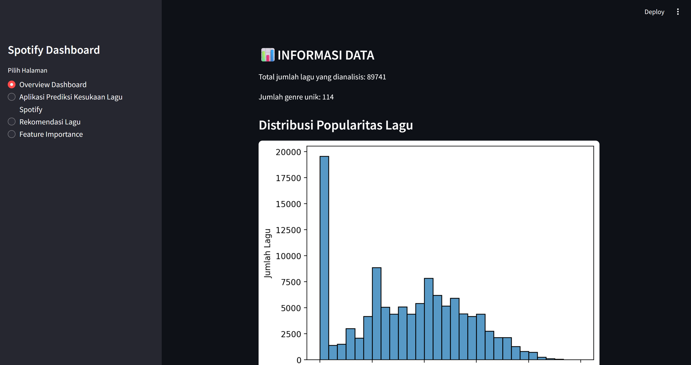
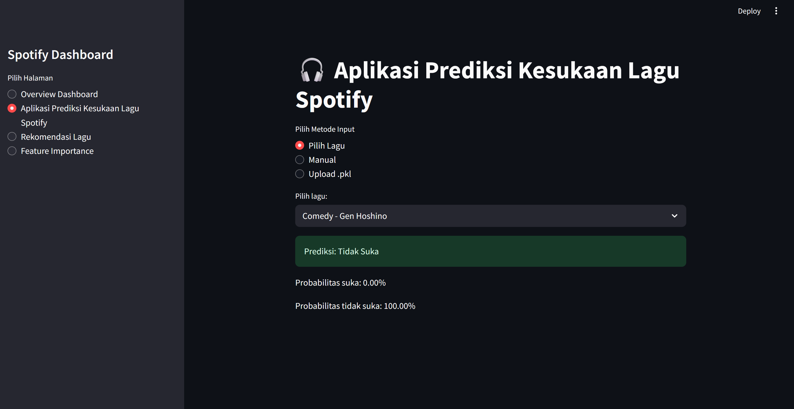

# 🎧 Dashboard Project Data Mining

Dashboard interaktif berbasis **Streamlit** untuk analisis dan prediksi kesukaan lagu dari Spotify.

---

## 🚀 Fitur Utama
- 📊 **Overview Dashboard** — Menampilkan ringkasan data dan insight
- 🎯 **Prediksi Kesukaan Lagu** — Memprediksi apakah user akan menyukai lagu
- 🎵 **Rekomendasi Lagu** — Memberikan rekomendasi berdasarkan preferensi
- 🔍 **Feature Importance** — Menampilkan fitur yang paling berpengaruh pada model

---

## 🧠 Model Machine Learning
Model digunakan untuk memprediksi apakah pengguna akan menyukai sebuah lagu berdasarkan fitur audio, seperti:
- popularity  
- danceability  
- energy  
- loudness  
- speechiness  
- dan fitur lainnya  

---

## 🛠️ Teknologi yang Digunakan
- Python  
- Streamlit  
- Scikit-learn  
- Pandas  
- Matplotlib  

---
## 📸 Tampilan Dashboard

---

## 🚀 Demo Online
👉 [(Dahsboard Spotify)]([https://drive.google.com/file/d/1Mw5pXBtrdGfu8WHRdJlnGVXiimBV9KoZ/view?usp=drive_link](http://localhost:8502))

---

## ▶️ Cara Menjalankan Project

1. Install dependencies:

    pip install -r requirements.txt

2. Jalankan aplikasi:

    streamlit run halaman_utama.py

---

## 📁 Struktur Project

    halaman_utama.py
    feature_importance.py
    song_recommendation.py
    overview.py
    favorite_song_prediction.py

---

## 👤 Author

Revinda Visma Novatalia
202210370311176
